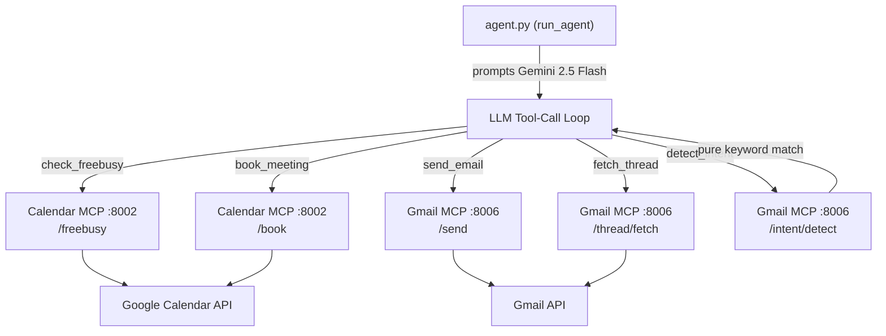

# CalSync Agent — Scheduling Logic Deep Dive

## How the Agent Actually Works

### Architecture Overview



---

## Exact Step-by-Step Scheduling Logic

### 1. Entry Point — `run_agent(situation: dict)`

The agent is invoked with a `situation` dict that carries **all context upfront**:
```python
{
  "meeting_title": "...",
  "organizer": "email@...",
  "participants": [...],
  "session_id": "sess_...",
  "status": "AWAITING_REPLIES" | "READY_TO_COMPUTE" | "NO_OVERLAP",
  "proposed_slots": [...],   # only in READY_TO_COMPUTE
  "all_replied": bool
}
```

**The `status` field is the single control switch** that determines the entire agent behavior path.

---

### 2. Prompt Construction — Status-Gated Routing

```python
# agent.py lines 233–261
if status == "AWAITING_REPLIES":
    prompt = """...Send availability request emails to all participants (not the organizer)..."""

elif status == "READY_TO_COMPUTE":
    prompt = """...Steps:
    1. check_freebusy
    2. book_meeting
    3. send_email confirmation..."""

elif status == "NO_OVERLAP":
    prompt = """...Send clarification emails asking for more slots..."""
```

The **entire scheduling context is embedded in the prompt as raw JSON** — there is no dynamic memory, no thread-read, no state lookup from a database. The LLM only knows what's in `situation`.

---

### 3. Agentic Tool-Call Loop (max 10 steps)

```python
contents = [types.Content(role="user", parts=[types.Part(text=prompt)])]

for step in range(1, 11):
    response = client.models.generate_content(model, contents, config)
    
    # Append model response to rolling history
    contents.append(types.Content(role="model", parts=response.candidates[0].content.parts))
    
    # Extract function calls
    fn_calls = [p.function_call for p in response.parts if p.function_call]
    
    if not fn_calls:
        break  # LLM finished — no more tool calls
    
    # Execute each tool, collect results
    tool_parts = []
    for fn in fn_calls:
        result = execute_tool(fn.name, dict(fn.args), ctx)
        tool_parts.append(FunctionResponse(name=fn.name, response=result))
    
    contents.append(types.Content(role="user", parts=tool_parts))
    
    # Early exit conditions
    if ctx.get("confirmation_sent"): break
    if ctx.get("availability_sent") and status == "AWAITING_REPLIES": break
    if ctx.get("clarification_sent") and status == "NO_OVERLAP": break
```

**Key insight**: The LLM drives all decisions. The loop only terminates early based on a small in-memory `ctx` dict that tracks whether emails were sent. Otherwise it runs until 10 steps or the LLM stops calling tools.

---

### 4. Early-Exit Detection — Subject-Keyword Hack

The `ctx` flags are set inside `execute_tool` by checking the **email subject line**:

```python
# agent.py lines 187–193
subj = args.get("subject", "").lower()
if "confirm" in subj or "booked" in subj or "scheduled" in subj:
    ctx["confirmation_sent"] = True
elif "available" in subj or "availability" in subj or "schedule" in subj:
    ctx["availability_sent"] = True
elif "clarif" in subj or "no overlap" in subj or "no common" in subj:
    ctx["clarification_sent"] = True
```

> [!WARNING]
> This is entirely heuristic — if the LLM writes a subject that doesn't include expected keywords (e.g. "Meeting Confirmed for Tuesday"), the agent **never exits early** and burns all 10 steps. Conversely, an availability email with subject "Let's schedule a time" would set `availability_sent=True` even for a `READY_TO_COMPUTE` flow.

---

### 5. Thread ID Handling — The Root Problem

When the agent calls `send_email`, it passes a `thread_id`:
```python
# agent.py → execute_tool → send_email
r = httpx.post(f"{GMAIL_MCP}/send", json={
    "to_emails": args["to_emails"],
    "subject":   args["subject"],
    "body_text": args["body_text"],
    "thread_id": args.get("thread_id"),   # ← optional, LLM must provide this
    "session_id": args.get("session_id")
})
```

The Gmail client uses `thread_id` to thread the reply:
```python
# gmail_client.py line 170–171
if req.thread_id:
    body["threadId"] = req.thread_id
```

**But `in_reply_to` and `references` headers are never set** unless the caller explicitly provides them. The MIME builder supports them:
```python
# gmail_client.py lines 122–125
if req.in_reply_to:
    msg["In-Reply-To"] = req.in_reply_to
if req.references:
    msg["References"] = req.references
```

However, `SendEmailRequest` only exposes `in_reply_to` and `references` as optional fields — and the agent tool definition **does not include these parameters**:

```python
# agent.py — send_email tool declaration, lines 73–86
# Parameters: to_emails, subject, body_text, thread_id, session_id
# MISSING: in_reply_to, references
```

So **the LLM can never set RFC 2822 threading headers**, only the Gmail `threadId` body param. Gmail's behavior with `threadId` alone (without proper headers) is inconsistent — it may or may not properly thread the message in participants' inboxes (especially non-Gmail clients).

---

### 6. Intent Detection — Pure Keyword Matching (No LLM)

```python
# intent_detector.py
def detect_email_intent(req):
    # Stage 1: broad guard — any scheduling keyword?
    if not detect_scheduling_keywords(req.subject, req.body_text):
        return IntentDetectionResponse(intent="OTHER", confidence=0.99)
    
    # Stage 2: ordered priority matching
    # CANCELLATION → RESCHEDULE → STATUS_QUERY → AVAILABILITY_REPLY → SCHEDULING_REQUEST → AMBIGUOUS
```

`detect_scheduling_keywords` only checks the **first 200 characters of the body**:
```python
combined = (subject + " " + body[:200]).lower()
```

> [!CAUTION]
> If a participant replies with several lines of pleasantries before giving availability, the actual availability content could be cut off and the intent misclassified as `AMBIGUOUS` or `OTHER`.

---

### 7. Thread Fetching — Never Used in Scheduling Flow

There is a `fetch_thread` tool declared in the agent, but the scheduling prompts **never instruct the LLM to call it**. The prompts for `AWAITING_REPLIES`, `READY_TO_COMPUTE`, and `NO_OVERLAP` all contain the full situation in JSON — the LLM has no instruction to look up thread history first.

The `thread_service.fetch_and_store_thread()` function **always returns `summary=None`** — no LLM summarization happens:
```python
# thread_service.py line 146
return ThreadResponse(thread_id=thread_id, emails=email_records, count=len(email_records), summary=None)
```

---

## Root Causes of the Two Reported Issues

### Issue 1: Unnecessary Replies to Participants

| Root Cause | Location | Detail |
|---|---|---|
| No deduplication guard | `agent.py` | Every invocation of `run_agent` starts fresh — no check if emails were already sent for this session/thread |
| No `already_sent` state in `situation` | Caller / ingestion | The `situation` dict has no `emails_already_sent` or `last_sent_at` field |
| `AWAITING_REPLIES` sends to everyone in `participants` | `agent.py` line 234 | Prompt says "all participants (not the organizer)" — but if `organizer` is also in `participants` list, the LLM may still email them |
| Subject-keyword exit is fragile | `agent.py` line 187 | Loop may not exit after first send → LLM re-sends |
| `book_meeting` via Google Calendar **also sends invites** | `calendar_client.book_meeting` | Google Calendar auto-sends invite emails to all attendees — then the agent **also** sends a `send_email` confirmation → participants receive **two** emails |

### Issue 2: Thread Context Not Retained

| Root Cause | Location | Detail |
|---|---|---|
| `thread_id` is passed by value from the LLM | `agent.py` tool call | The LLM must hallucinate or carry the thread_id through tool calls; it is never looked up from a database |
| `in_reply_to` / `references` never set | `agent.py` tool declaration | RFC 2822 threading headers missing from tool schema — Gmail threadId alone is unreliable across email clients |
| `fetch_thread` is never called proactively | `agent.py` prompts | Prompts don't instruct the LLM to fetch existing thread history before acting |
| No `message_id_header` passed back to agent | `execute_tool` | `send_email` result returns only `{status, message_id, thread_id, email_id}` — LLM cannot build `References` chain even if it wanted to |

---

## Recommended Fixes

### Fix 1: Prevent Double-Send (Google Calendar invites + confirmation email)

The Calendar `/book` call via Google Calendar API **already sends invite emails to all participants**. The agent then also calls `send_email` with a confirmation. This causes double emails.

**Options:**
- Pass `sendUpdates: "none"` to the Google Calendar API in `calendar_client.book_meeting()`, so only the agent's email goes out
- OR skip the `send_email` confirmation step when the LLM books — add a system prompt rule: *"After book_meeting, do NOT send a separate confirmation. Calendar invites are sent automatically."*

### Fix 2: Session-Level Deduplication Guard

Add a `emails_sent` tracking field to the SupaBase `scheduling_sessions` table. Before executing `send_email`, check if an outbound email with the same `session_id` + intent type already exists.

```python
# In execute_tool → send_email, before sending:
existing = supabase.table("emails") \
    .select("id") \
    .eq("session_id", session_id) \
    .eq("direction", "OUTBOUND") \
    .execute()
if existing.data:
    return {"status": "already_sent", "skipped": True}
```

### Fix 3: Add `in_reply_to` + `references` to the `send_email` Tool Schema

```python
# agent.py — add to send_email FunctionDeclaration parameters:
"in_reply_to": types.Schema(type="STRING", description="Message-ID header of the email being replied to"),
"references": types.Schema(type="STRING", description="Space-separated Message-IDs for the References header"),
```

And instruct the agent in the system prompt to always call `fetch_thread` first to get the last message's `message_id_header` to populate these fields.

### Fix 4: Proactive Thread Fetch in Prompts

Add to every prompt:
```
Before sending any email, call fetch_thread(thread_id) to read conversation history
and avoid repeating previously sent content. Use the last message's message_id_header
as the in_reply_to value.
```

### Fix 5: Harden the Organizer Exclusion

Scenario 2 (`AWAITING_REPLIES`) has:
```python
"participants": ["ameyans0905@gmail.com", "samhp924@gmail.com", "konarknehetepict@gmail.com"]
"organizer": "ameyapict@gmail.com"
```
Here organizer is not in participants — but Scenario 1 (`READY_TO_COMPUTE`) includes organizer in participants. If the agent sends confirmation emails to `participants` (which includes the organizer), the organizer receives a copy addressed to themselves from their own scheduling assistant — confusing.

**Fix**: Always exclude `organizer` from `to_emails` in availability + confirmation emails. Enforce this in `execute_tool`, not just the system prompt.

### Fix 6: Replace Subject-Keyword Early-Exit with Explicit Flags

```python
# Instead of checking subject keywords, have the LLM return a structured result
# or use a proper tool result field:
if result.get("email_type") == "confirmation":
    ctx["confirmation_sent"] = True
```

Or add a dedicated `mark_done(action_type: str)` tool that the LLM explicitly calls to signal completion, removing the fragile string heuristic.
